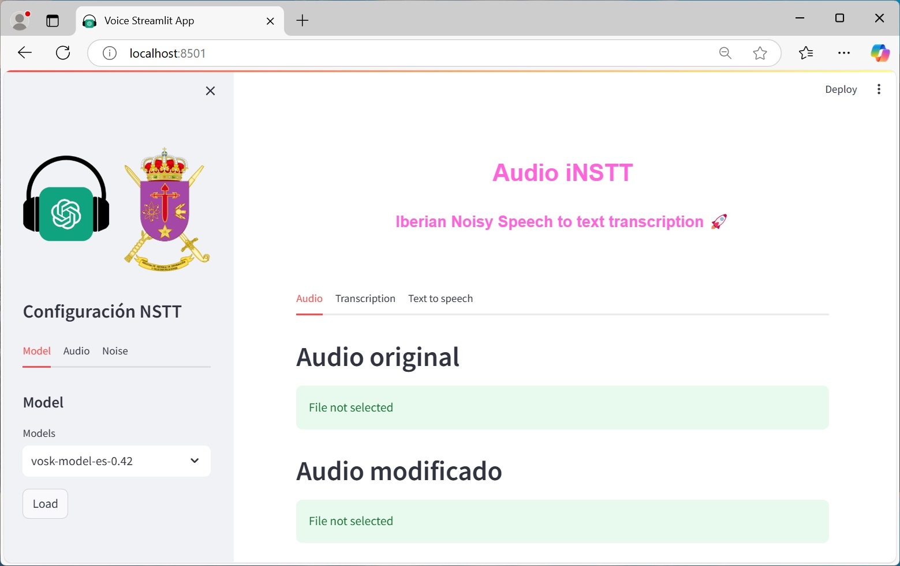

# nstt-tts
Does speech to text transcription in noisy environments and also text to speech

Realiza transcripciones de voz a texto en entornos ruidosos y también de texto a voz

# Before RUN
Download models from Vosk
Vosk models: https://alphacephei.com/vosk/models

# Run
> streamlit run audiostream.py

Opens a webpage in localhost:8501

# Framework
Web framework

